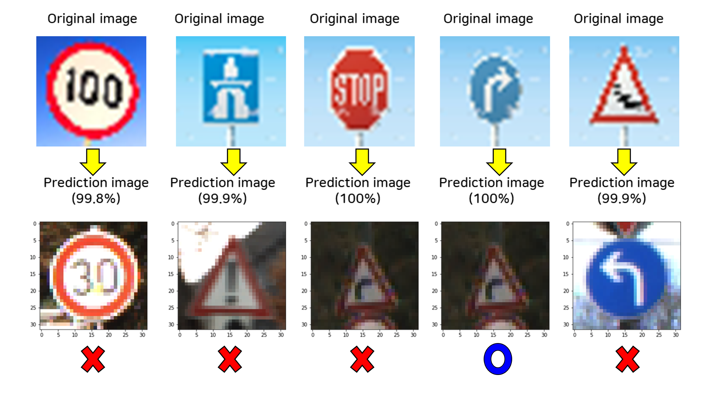

# SELF DRIVING CAR NANODEGREE
# Project3. Traffic Sign Classifier

[//]: # (Image References)

[image1-1]: ./images/2-train-dataset-graph.png "HISTOGRAM OF TRAIN DATA"
[image1-2]: ./images/3-test-dataset-graph.png "HISTOGRAM OF TEST DATA"
[image1-3]: ./images/4-valid-dataset-graph.png "HISTOGRAM OF VALID DATA"

[image2]: ./images/결과.png "RESULT OF PREDICTION"

[image3-1]: ./images/resized_traffic_sign_1.png "download image1"
[image3-2]: ./images/resized_traffic_sign_2.png "download image2"
[image3-3]: ./images/resized_traffic_sign_3.png "download image3"
[image3-4]: ./images/resized_traffic_sign_4.png "download image4"
[image3-5]: ./images/resized_traffic_sign_5.png "download image5"


## 1. Abstraction

This project object is making traffic sign classifier by using tensorflow and accuracy of validation set have to upper than 93%

Traffic sign data set is given by 'German Traffic Sign Dataset'

The dataset is already devided into 3 parts

```train.p``` : 34799 images

```test.p``` : 12630 images

```validation.p``` : 4410 images

Each set have 43 classes, that means there are 43 sort of traffic signs

And shape of each images is (32,32,3), that means image size is (32,32) and it has RGB channels

This is histogram of each dataset classes distribution


[ image source : Ryein Goddard github (https://github.com/Goddard/udacity-traffic-sign-classifier)]


I defined LeNet function that has already known architecture


| Layer         		|     Description	        					|
|:---------------------:|:---------------------------------------------:|
| Input         		| 32x32x3 RGB image   							|
| Convolution 5x5x3     	| 1x1 stride, valid padding, outputs 28x28x20 	|
| RELU					|												|
| Max pooling	      	| 2x2 stride,  outputs 14x14x20 				|
| Convolution 5x5	    | 2x2 stride, valid padding, outputs 10x10x50    |
| RELU					|												|
| Max pooling	      	| 2x2 stride,  outputs 5x5x50 				|
| Flatten  	    |       outputs 1x1x1250    |
| RELU					|												|
| Fully connected		| input 1250, output 200        									|
| RELU					|												|     									|
| Fully connected		| input 200, output 100        									|
| RELU					|												|    									|
| Fully connected		| input 100, output 43        									|

And finally I tested this model to classify 5 really German traffic sign download at google image

     


## 2. Related Study

#### 1) Neural Network

① Logistic regression

② Applying to higher dimension

③ Perceptrons

④ Error functions

⑤ Softmax

⑥ One hot encoding

⑦ Gradient descent

⑧ Backpropagation

⑨ Neural Network architecture

#### 2) Tensorflow

① Deep learning frameworks

② Use tensorflow to apply Neural Net

#### 3) Deep Neural Net

① ReLU

② 2-Layer Neural Net

③ Training a Deep Learning network

④ Save and restore Tensorflow models

⑤ Regularization

⑥ Drop out

#### 4) Convolutional Neural Network

① Characteristics of CNN

② Filter

③ Number of parameters

④ Parameter sharing

⑤ Visualizing CNN

⑥ Sub sampling

⑦ Inception module


#### 5) LeNet

① LeNet architecture

② Use tensorflow to realize LeNet


## 3. Details

#### 1) Load Data

The dataset is already devided into 3 parts

```train.p``` : 34799 images

```test.p``` : 12630 images

```validation.p``` : 4410 images


```python
import pickle

training_file = '../data/train.p'
validation_file= '../data/valid.p'
testing_file = '../data/test.p'

with open(training_file, mode='rb') as f:
    train = pickle.load(f)
with open(validation_file, mode='rb') as f:
    valid = pickle.load(f)
with open(testing_file, mode='rb') as f:
    test = pickle.load(f)
    
X_train, y_train = train['features'], train['labels']
X_valid, y_valid = valid['features'], valid['labels']
X_test, y_test = test['features'], test['labels']
```


#### 2) Define LeNet Function

```python
from tensorflow.contrib.layers import flatten

def LeNet(x):

    mu = 0
    sig = 0.1
    

    conv1_W = tf.Variable(tf.truncated_normal(shape = (5,5,3,20), mean = mu, stddev = sig), name = 'conv1_W')
    
    conv1_W = tf.get_variable("conv1_W", shape = (5,5,3,20), initializer = tf.contrib.layers.xavier_initializer())
    
    conv1_b = tf.Variable(tf.zeros(20), name = 'conv1_b')
    
    conv1 = tf.nn.conv2d(x, conv1_W, strides = [1,1,1,1], padding = 'VALID') + conv1_b
    
    conv1 = tf.nn.relu(conv1)
    
    #conv1 = tf.nn.dropout(conv1, keep_prob = keep_prob_train)
    
    conv1 = tf.nn.max_pool(conv1, ksize = [1,2,2,1], strides = [1,2,2,1], padding = 'VALID')
    
    conv2_W = tf.Variable(tf.truncated_normal(shape = (5,5,20,50), mean = mu, stddev = sig), name = 'conv2_W')
    
    conv2_W = tf.get_variable("conv2_W", shape = (5,5,20,50), initializer = tf.contrib.layers.xavier_initializer())
    
    conv2_b = tf.Variable(tf.zeros(50), name = 'conv2_b')
    
    conv2 = tf.nn.conv2d(conv1, conv2_W, strides = [1,1,1,1], padding = 'VALID') + conv2_b
    
    conv2 = tf.nn.relu(conv2)

    #conv2 = tf.nn.dropout(conv2, keep_prob = keep_prob_train)
    
    conv2 = tf.nn.max_pool(conv2, ksize = [1,2,2,1], strides = [1,2,2,1], padding = 'VALID')
    
    fc0 = flatten(conv2)
    
    fc1_W = tf.Variable(tf.truncated_normal(shape = (1250,200), mean = mu, stddev = sig), name = 'fc1_W')

    fc1_W = tf.get_variable("fc1_W", shape = (1250,200), initializer = tf.contrib.layers.xavier_initializer())
    
    fc1_b = tf.Variable(tf.zeros(200), name = 'fc1_b')
    
    fc1 = tf.matmul(fc0, fc1_W) + fc1_b
    
    fc1 = tf.nn.relu(fc1)
    
    #fc1 = tf.nn.dropout(fc1, keep_prob = 0.7)    

    fc2_W = tf.Variable(tf.truncated_normal(shape = (200,100), mean = mu, stddev = sig), name = 'fc2_W')
    
    fc2_W = tf.get_variable("fc2_W", shape = (200,100), initializer = tf.contrib.layers.xavier_initializer())
    
    fc2_b = tf.Variable(tf.zeros(100), name = 'fc2_b')
    
    fc2 = tf.matmul(fc1, fc2_W) + fc2_b

    fc2 = tf.nn.relu(fc2)

    #fc2 = tf.nn.dropout(fc2, keep_prob = 0.7) 

    fc3_W = tf.Variable(tf.truncated_normal(shape = (100,43), mean = mu, stddev = sig), name = 'fc3_W')
    
    fc3_W = tf.get_variable("fc3_W", shape = (100,43), initializer = tf.contrib.layers.xavier_initializer())
    
    fc3_b = tf.Variable(tf.zeros(43), name = 'fc3_b')
    
    fc3 = tf.matmul(fc2, fc3_W) + fc3_b
    
    logits = fc3
    
    return logits
```

#### 3) Train data

Getting a train data, find optimum paprameters

For each EPOCH, calculate validation accuracy

Finally I have to get a higher than 93% validation accuracy

```python
import tensorflow as tf
from tensorflow.contrib.layers import flatten

x = tf.placeholder(tf.float32, (None, 32,32,3))
y = tf.placeholder(tf.int32, (None))
one_hot_y = tf.one_hot(y, 43)

logits = LeNet(x)
cross_entropy = tf.nn.softmax_cross_entropy_with_logits(labels = one_hot_y, logits = logits)
loss_operation = tf.reduce_mean(cross_entropy)
optimizer = tf.train.AdamOptimizer(learning_rate = rate)
training_operation = optimizer.minimize(loss_operation)

EPOCHS = 12
BATCH_SIZE = 128

with tf.Session() as sess:
    sess.run(tf.global_variables_initializer())
    num_examples = len(X_train)
    
    print("Training....")
    print()
    for i in range(EPOCHS):
        X_train, y_train = shuffle(X_train, y_train)
        for offset in range(0, num_examples, BATCH_SIZE):
            end = offset + BATCH_SIZE
            batch_x, batch_y = X_train[offset:end], y_train[offset:end]
            sess.run(training_operation, feed_dict={x:batch_x, y:batch_y})
        validation_accuracy = evaluate(X_valid,y_valid)
        print("EPOCH : {}".format(i+1))
        print("Validation accuracy = {:.3f}".format(validation_accuracy))
        print()

    saver = tf.train.Saver()
    saver.save(sess, 'lenet.ckpt')
    print("Value saved")  
```
```python

def evaluate(X_data, y_data):
    num_examples = len(X_data)
    total_accuracy = 0
    sess = tf.get_default_session()
    for offset in range(0, num_examples, BATCH_SIZE):
        batch_x, batch_y = X_data[offset:offset + BATCH_SIZE], y_data[offset:offset + BATCH_SIZE]
        accuracy = sess.run(accuracy_operation, feed_dict = {x:batch_x, y:batch_y})
        total_accuracy += (accuracy * len(batch_x))
        
    return total_accuracy / num_examples   
```

Epochs : 12

Validation loss: 0.949

#### 4) Evaluate Data For Test Images

I loaded saved parameters (lenet.ckpt) and applied to test images

```python

with tf.Session() as sess:
    sess.run(tf.global_variables_initializer())
    loader = tf.train.import_meta_graph('lenet.ckpt.meta')
    loader.restore(sess, tf.train.latest_checkpoint('./'))
    test_accuracy = evaluate(X_test, y_test)
    print("Test Accuracy = {:.3f}".format(test_accuracy))
    
```

Finally test accuracy was 92.6%


#### 5) Apply to new image

Until now, I trained and saved Lenet architecture parameters and now, I will test if this model can classifiy

german traffic signs searched at google

I downloaded German traffic signs at google, and resized image (32,32,3)

① Preparation of new images

```python

from PIL import Image
import numpy as np
import matplotlib.pyplot as plt

new_1 = 'resized_traffic_sign_1.png'
new_1 = Image.open(new_1)

new_2 = 'resized_traffic_sign_2.png'
new_2 = Image.open(new_2)

new_3 = 'resized_traffic_sign_3.png'
new_3 = Image.open(new_3)

new_4 = 'resized_traffic_sign_4.png'
new_4 = Image.open(new_4)

new_5 = 'resized_traffic_sign_5.png'
new_5 = Image.open(new_5)

image = []

im_1 = np.array(new_1, dtype = np.float32)
im_2 = np.array(new_2, dtype = np.float32)
im_3 = np.array(new_3, dtype = np.float32)
im_4 = np.array(new_4, dtype = np.float32)
im_5 = np.array(new_5, dtype = np.float32)

image.append(im_1)
image.append(im_2)
image.append(im_3)
image.append(im_4)
image.append(im_5)

```

② Restore parameters and do classify

```python

tf.reset_default_graph()

conv1_W = tf.get_variable('conv1_W', shape = (5,5,3,20))
conv1_b = tf.get_variable('conv1_b', shape = (20))
conv2_W = tf.get_variable('conv2_W', shape = (5,5,20,50))
conv2_b = tf.get_variable('conv2_b', shape = (50))
fc1_W = tf.get_variable('fc1_W', shape = (1250,200))
fc1_b = tf.get_variable('fc1_b',shape = (200))
fc2_W = tf.get_variable('fc2_W',shape = (200,100))
fc2_b = tf.get_variable('fc2_b',shape = (100))
fc3_W = tf.get_variable('fc3_W',shape = (100,43))
fc3_b = tf.get_variable('fc3_b',shape = (43))

saver = tf.train.Saver()

with tf.Session() as sess:

    saver.restore(sess, "lenet.ckpt")
    print("Model restored.")

    
    softmax_new_images = []
    
    for i in range(5):
        image_final = [tf.cast(image[i], tf.float32)]
        test_index = LeNet_test(image_final)
        logits = sess.run(test_index)
        index_test = tf.argmax(logits, 1)
        softmax_new_images.append(sess.run(tf.nn.softmax(logits)))
        print("Y value for image", i+1, ":", sess.run(index_test))
    
    print(sess.run(tf.nn.top_k(tf.constant(np.squeeze(softmax_new_images)), k=5)))

```
```python

def LeNet_test(x):
    conv1 = tf.nn.conv2d(x, conv1_W, strides = [1,1,1,1], padding = 'VALID') + conv1_b
    conv1 = tf.nn.relu(conv1)
    conv1 = tf.nn.max_pool(conv1, ksize = [1,2,2,1], strides = [1,2,2,1], padding = 'VALID')
    
    conv2 = tf.nn.conv2d(conv1, conv2_W, strides = [1,1,1,1], padding = 'VALID') + conv2_b
    conv2 = tf.nn.relu(conv2)
    conv2 = tf.nn.max_pool(conv2, ksize = [1,2,2,1], strides = [1,2,2,1], padding = 'VALID')
    
    fc0 = flatten(conv2)
    
    fc1 = tf.matmul(fc0, fc1_W) + fc1_b
    fc1 = tf.nn.relu(fc1)
    
    fc2 = tf.matmul(fc1, fc2_W) + fc2_b
    fc2 = tf.nn.relu(fc2)
    
    fc3 = tf.matmul(fc2, fc3_W) + fc3_b
    
    logits = fc3
    
    return logits
    
```

## 4. Results

* validation set accuracy of 94.9%
* test set accuracy of 92.6%

I used this model to predict new traffic sign images downloaded at goole

I searched German traffic sign, thats because I trained by german traffic sign images

Below is result of prediction




## 5. Discussion

If we see the result of test dataset, classification accuracy was good

But result of applying to real traffic sign images was not good

It means trained parameters are overfitted to data

Above all, train data set has about 34000 images that are distributed to 43 sorts

That means each sort has under 1000 images

It is by no means a large amount

It maybe effective augment train data

We could rotate, crop, flip etc.. so could make more than 10,000 images for each class

That will make our LeNet more powerful

Secondly, it would be better using gray scale image than using RGB images

Because our purpose is just classifying traffic signs, we need to reduce complexity
